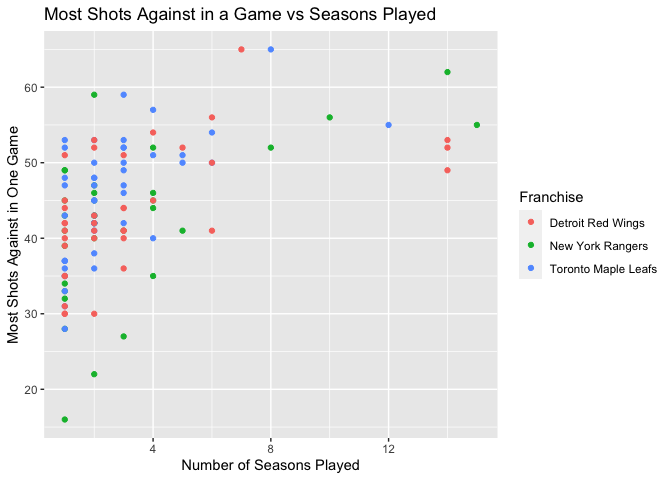

ST558Project1
================
Shuang Du
9/4/2020

# Project 1

## Set the libraries needed

``` r
# devtools::install_github("r-dbi/bigrquery")
library(tidyverse)
library(httr)
library(jsonlite);
library(RSQLite);
library(kableExtra);
```

### These were the two URLS for the two APIs

``` r
# global values
base_url_records <- "https://records.nhl.com/site/api"
base_url_stats <- "https://statsapi.web.nhl.com/api/v1/teams"
```

## Create Functions for <https://records.nhl.com/site/api>

### The functions that take identifiers in this section are only numerical, the wrapper function will provide the ability to interpret string values as well.

``` r
# Get all the franchises
getAllFranchises <- function(...) {
  tab_name <- "franchise"
  full_url <- paste0(base_url_records, "/", tab_name)
  
  res <- content(GET(full_url), as="text")
  resR <- fromJSON(res, flatten=TRUE)
  
  return(resR)
}

# Get all the team totals
getTeamTotals <- function(...) {
  tab_name <- "franchise-team-totals"
  full_url <- paste0(base_url_records, "/", tab_name)
  
  res <- content(GET(full_url), as="text")
  resR <- fromJSON(res, flatten=TRUE)
  
  return(resR)
}

# Get franchise season records
getFranchiseSeasonRecords <- function(identifier,...) {

  if (!is.character(identifier) && !is.numeric(identifier)) {
    stop("Invalid identifier type, please specify a character or number")
  }
  
  teamID = identifier
  
  
  tab_name <- "franchise-season-records?cayenneExp=franchiseId="
  full_url <- paste0(base_url_records, "/", tab_name, as.character(teamID))

  res <- content(GET(full_url), as="text")
  resR <- fromJSON(res, flatten=TRUE)

  return(resR)
}

# Get goalie records for a particular team
getGoalieRecords <- function(identifier,...) {

  if (!is.character(identifier) && !is.numeric(identifier)) {
    stop("Invalid identifier type, please specify a character or number")
  }
  teamID = identifier
  
  tab_name <- "franchise-goalie-records?cayenneExp=franchiseId="
  full_url <- paste0(base_url_records, "/", tab_name, as.character(teamID))

  res <- content(GET(full_url), as="text")
  resR <- fromJSON(res, flatten=TRUE)

  return(resR)
}

# Get skater records for particular team
getSkaterRecords <- function(identifier,...) {

  if (!is.character(identifier) && !is.numeric(identifier)) {
    stop("Invalid identifier type, please specify a character or number")
  }
  teamID = identifier
  
  tab_name <- "franchise-skater-records?cayenneExp=franchiseId="
  full_url <- paste0(base_url_records, "/", tab_name, as.character(teamID))

  res <- content(GET(full_url), as="text")
  resR <- fromJSON(res, flatten=TRUE)
  
  return(resR)
}
```

## This function his the endpoint <https://statsapi.web.nhl.com/api/v1/teams>

### Options (roster, names, previousGame, nextGame, stats, season), teamID, statType, and season encompass the various parameters in the requirements

``` r
getTeam <- function(options=NULL, teamID=NULL, statType=NULL, season=NULL, ...) {
  
  tab_name <- "?"
  params <- ""
  
  if (!is.vector(options) && !is.null(options)) {
    stop('Options, must be a vector of the following (roster, names, previousGame, nextGame, stats, season)')
  }
  
  if (!is.character(season) && !is.numeric(season) && !is.null(season)) {
    stop("Invalid input type, season must be in the form of two four digit years i.e. 20142015")
  } else if(!is.null(season)) {
    params <- paste0(params, "expand=team.roster&season=",as.character(season),"&")
  }
  
  if (!is.character(statType) && !is.null(statType)) {
    stop("Invalid input type, statType must be a character string")
  } else if (!is.null(statType)) {
    params <- paste0(params, "stats=",statType,"&")
  }
  
  if (!is.character(teamID) && !is.numeric(teamID) && !is.null(teamID)) {
    stop("Invalid input type, teamID must be a numeric value")
  } else if (!is.null(teamID)){
    params <- paste0(params, "teamId=",as.character(teamID),"&")
  }
  
  
  if ('roster' %in% options) {
    params <- paste0(params, "expand=team.roster&")
  }
  if ('names' %in% options) {
    params <- paste0(params, "expand=person.names&")
  }
  if ('nextGame' %in% options) {
    params <- paste0(params, "expand=team.schedule.next&")
  }
  if ('previousGame' %in% options) {
    params <- paste0(params, "expand=team.schedule.previous&") 
  }
  if ('stats' %in% options) {
    params <- paste0(params, "expand=team.stats&")
  }


  full_url <- paste0(base_url_stats, "/", tab_name, params)
    
  res <- content(GET(full_url), as="text")
  resR <- fromJSON(res, flatten=TRUE)
  return(resR)
}
```

## Wrapper function

### Identifier can be either the TeamID or Team Name

### Note that the TeamID is different across the two APIs, so if the same TeamID is used information for different teams will result in the infoType==teamStats and the rest of the infoType options

``` r
## Wrapper Function


getInfo <- function(infoType, identifier=NULL, options=NULL, statType=NULL, season=NULL, ...) {
  
  if(!(infoType %in% c('franchise', 'teamTotals', 'seasonRecords', 'goalieRecords', 'skaterRecords','teamStats'))) {
    stop('No such api endpoint found, options are: franchise, teamTotals, seasonRecords, goalieRecords, skaterRecords, teamStats')
  }
  
  if(infoType == 'franchise') {
    return(getAllFranchises())
  } else if(infoType == 'teamTotals') {
    return(getTeamTotals())
  } else if(infoType %in% c('seasonRecords', 'goalieRecords', 'skaterRecords')) {
    if (is.character(identifier)) {
      franchiseDF <- getAllFranchises()[[1]]
      subsettedFranchiseTable <- franchiseDF %>% subset(teamCommonName==identifier)
      teamID <- subsettedFranchiseTable$id
      if(length(teamID) == 0) {
        stop("No team found for identifier")
      }
    } else {
      teamID = identifier
    }
    if(infoType == 'seasonRecords') {
      return(getFranchiseSeasonRecords(teamID))  
    } else if(infoType == 'goalieRecords') {
      print(teamID)
      return(getGoalieRecords(teamID)) 
    } else if(infoType == 'skaterRecords') {
      return(getSkaterRecords(teamID))
    }
    
  } else if(infoType == 'teamStats') {
    if (is.character(identifier)) {
      allTeams <- getTeam()
      subsettedTeamsTable <- allTeams[[2]] %>% subset(teamName==identifier)
      teamID <- subsettedTeamsTable$id
      if(length(teamID) == 0) {
        stop("No team found for identifier")
      }
    } else {
      teamID = identifier
    }
    return(getTeam(options=options, teamID=teamID, statType=statType, season=season))
  }
  
}

# Some test cases here
# getInfo(infoType='seasonRecords', identifier='Maple Leafs')
# getInfo(infoType='teamStats', identifier='Maple Leafs', season=20142015)
# getInfo(infoType='teamStats', identifier=10, season=20142015)
```

## At some point you should do a join on two returned datasets from different API endpoints (say combine them according to franchise ID)

### Here we are getting the goalie information from the maple leafs, the rangers, and the red wings. After these franchises and bound together we do an inner join with the return from the allTeams function on franchise name.

``` r
allTeams= getInfo(infoType='teamStats')
allTeamsDF <- allTeams$teams %>% rename(franchiseName = name)

MapleLeafGoaliesDF = getInfo(infoType='goalieRecords',identifier='Maple Leafs')$data
```

    ## No encoding supplied: defaulting to UTF-8.

    ## [1] 5

    ## No encoding supplied: defaulting to UTF-8.

``` r
RangerGoaliesDF = getInfo(infoType='goalieRecords',identifier='Rangers')$data
```

    ## No encoding supplied: defaulting to UTF-8.

    ## [1] 10

    ## No encoding supplied: defaulting to UTF-8.

``` r
RedWingsDF = getInfo(infoType='goalieRecords',identifier='Red Wings')$data
```

    ## No encoding supplied: defaulting to UTF-8.

    ## [1] 12

    ## No encoding supplied: defaulting to UTF-8.

``` r
allGoalies = rbind(RangerGoaliesDF, MapleLeafGoaliesDF, RedWingsDF)

joinedAllGoalies <- inner_join(allTeamsDF, allGoalies, by="franchiseName")
```

## You should create at least two new variables

### I am creating two variables here, one for the ratio of most goals against in one game and most wins in a season, and the other for most saves in a season divided by the number of seasons played.

``` r
joinedAllGoalies <- joinedAllGoalies %>% mutate(mShotsmWinsRatio = mostGoalsAgainstOneGame/mostWinsOneSeason, mostSavesSeasonsRatio = mostSavesOneGame/seasons)
```

## You should create some contingency tables

### Here are some contingency tables.

### The first table is a table of division abbreviation and conference name. As expected, half the division abbreviations fall in the Eastern conference and the other half fall in the Western conference.

### The second table is one of the time zones of each team vs their division abbreviation. As expected, most of the divisions fall mostly within one time zone. Interestingly, the pacific division teams are spread out among three time zones.

``` r
table(allTeamsDF$division.abbreviation, allTeamsDF$conference.name)
```

    ##    
    ##     Eastern Western
    ##   A       8       0
    ##   C       0       7
    ##   M       8       0
    ##   P       0       8

``` r
table(allTeamsDF$venue.timeZone.tz, allTeamsDF$division.nameShort)
```

    ##      
    ##       ATL CEN Metro PAC
    ##   CDT   0   6     0   0
    ##   EDT   8   0     8   0
    ##   MDT   0   1     0   2
    ##   MST   0   0     0   1
    ##   PDT   0   0     0   5

## You should create numerical summaries for some quantitative variables at each setting of some of your categorical variables

### The first summary table shows a summary of most saves in a game. I don’t know much about hockey, but the values seem pretty consistent among three random teams I chose.

### The second summary table shows the most wins in a season among active and inactive goalies. It seems here that the currently active players have a higher median number of most wins in a season vs inactive goalies.

### The third summary table shows most goals against in one game for goalies with greater than 10 seasons of experience (true) and those with less (false). As expected, for those with greater than ten seasons of experience, there is generally a higher value of most goals against in one game.

``` r
reducedGoalies1 <- allGoalies %>% select(franchiseName, mostSavesOneGame)
reducedGoalies2 <- allGoalies %>% select(activePlayer, mostWinsOneSeason)
reducedGoalies3 <- allGoalies %>% mutate('GreaterThanTenSeasons'= case_when(allGoalies$seasons>10 ~ TRUE, allGoalies$seasons <= 10 ~ FALSE)) %>% select(GreaterThanTenSeasons, mostGoalsAgainstOneGame)

mostSavesStats <- reducedGoalies1 %>% group_by(franchiseName) %>%  summarise( 
            n = n(),
            min = fivenum(mostSavesOneGame)[1],
            Q1 = fivenum(mostSavesOneGame)[2],
            median = fivenum(mostSavesOneGame)[3],
            Q3 = fivenum(mostSavesOneGame)[4],
            max = fivenum(mostSavesOneGame)[5]);
```

    ## `summarise()` ungrouping output (override with `.groups` argument)

``` r
mostWinsStats <- reducedGoalies2 %>% group_by(activePlayer) %>%  summarise( 
            n = n(),
            min = fivenum(mostWinsOneSeason)[1],
            Q1 = fivenum(mostWinsOneSeason)[2],
            median = fivenum(mostWinsOneSeason)[3],
            Q3 = fivenum(mostWinsOneSeason)[4],
            max = fivenum(mostWinsOneSeason)[5]);
```

    ## `summarise()` ungrouping output (override with `.groups` argument)

``` r
experienceMostGoalsAgainst <- reducedGoalies3 %>% group_by(GreaterThanTenSeasons) %>%  summarise( 
            n = n(),
            min = fivenum(mostGoalsAgainstOneGame)[1],
            Q1 = fivenum(mostGoalsAgainstOneGame)[2],
            median = fivenum(mostGoalsAgainstOneGame)[3],
            Q3 = fivenum(mostGoalsAgainstOneGame)[4],
            max = fivenum(mostGoalsAgainstOneGame)[5]);
```

    ## `summarise()` ungrouping output (override with `.groups` argument)

``` r
kable(mostSavesStats, caption='Summary of Most Saves in One Game')
```

<table>

<caption>

Summary of Most Saves in One Game

</caption>

<thead>

<tr>

<th style="text-align:left;">

franchiseName

</th>

<th style="text-align:right;">

n

</th>

<th style="text-align:right;">

min

</th>

<th style="text-align:right;">

Q1

</th>

<th style="text-align:right;">

median

</th>

<th style="text-align:right;">

Q3

</th>

<th style="text-align:right;">

max

</th>

</tr>

</thead>

<tbody>

<tr>

<td style="text-align:left;">

Detroit Red Wings

</td>

<td style="text-align:right;">

48

</td>

<td style="text-align:right;">

26

</td>

<td style="text-align:right;">

36

</td>

<td style="text-align:right;">

38

</td>

<td style="text-align:right;">

45

</td>

<td style="text-align:right;">

56

</td>

</tr>

<tr>

<td style="text-align:left;">

New York Rangers

</td>

<td style="text-align:right;">

42

</td>

<td style="text-align:right;">

14

</td>

<td style="text-align:right;">

36

</td>

<td style="text-align:right;">

40

</td>

<td style="text-align:right;">

44

</td>

<td style="text-align:right;">

59

</td>

</tr>

<tr>

<td style="text-align:left;">

Toronto Maple Leafs

</td>

<td style="text-align:right;">

53

</td>

<td style="text-align:right;">

24

</td>

<td style="text-align:right;">

36

</td>

<td style="text-align:right;">

42

</td>

<td style="text-align:right;">

48

</td>

<td style="text-align:right;">

60

</td>

</tr>

</tbody>

</table>

``` r
kable(mostWinsStats, caption='Summary of Most Wins in One Season')
```

<table>

<caption>

Summary of Most Wins in One Season

</caption>

<thead>

<tr>

<th style="text-align:left;">

activePlayer

</th>

<th style="text-align:right;">

n

</th>

<th style="text-align:right;">

min

</th>

<th style="text-align:right;">

Q1

</th>

<th style="text-align:right;">

median

</th>

<th style="text-align:right;">

Q3

</th>

<th style="text-align:right;">

max

</th>

</tr>

</thead>

<tbody>

<tr>

<td style="text-align:left;">

FALSE

</td>

<td style="text-align:right;">

130

</td>

<td style="text-align:right;">

0

</td>

<td style="text-align:right;">

4

</td>

<td style="text-align:right;">

12

</td>

<td style="text-align:right;">

24

</td>

<td style="text-align:right;">

44

</td>

</tr>

<tr>

<td style="text-align:left;">

TRUE

</td>

<td style="text-align:right;">

13

</td>

<td style="text-align:right;">

0

</td>

<td style="text-align:right;">

4

</td>

<td style="text-align:right;">

16

</td>

<td style="text-align:right;">

26

</td>

<td style="text-align:right;">

39

</td>

</tr>

</tbody>

</table>

``` r
kable(experienceMostGoalsAgainst, caption='Summary of Most Goals Against in One Game')
```

<table>

<caption>

Summary of Most Goals Against in One Game

</caption>

<thead>

<tr>

<th style="text-align:left;">

GreaterThanTenSeasons

</th>

<th style="text-align:right;">

n

</th>

<th style="text-align:right;">

min

</th>

<th style="text-align:right;">

Q1

</th>

<th style="text-align:right;">

median

</th>

<th style="text-align:right;">

Q3

</th>

<th style="text-align:right;">

max

</th>

</tr>

</thead>

<tbody>

<tr>

<td style="text-align:left;">

FALSE

</td>

<td style="text-align:right;">

136

</td>

<td style="text-align:right;">

0

</td>

<td style="text-align:right;">

6.0

</td>

<td style="text-align:right;">

7

</td>

<td style="text-align:right;">

8.0

</td>

<td style="text-align:right;">

15

</td>

</tr>

<tr>

<td style="text-align:left;">

TRUE

</td>

<td style="text-align:right;">

7

</td>

<td style="text-align:right;">

7

</td>

<td style="text-align:right;">

7.5

</td>

<td style="text-align:right;">

9

</td>

<td style="text-align:right;">

9.5

</td>

<td style="text-align:right;">

10

</td>

</tr>

</tbody>

</table>

## You should create at least five plots utilizing coloring, grouping, etc. All plots should have nice labels and titles.

### You should have at least one bar plot, one histogram, one box plot, and one scatter plot

### Plot 1: Boxplot of Number of Games Played Among the Goalies of Three Franchises

### The data show that in general, the three franchises have similar numbers of games played among their goalies, with the Rangers having the lowest IQR and the Maple Leafs the highest.

### Plot 2: Histogram for Most Goals Against in One Game

### Interestingly, the most goals against in one game aggregated among the three franchises form a normal(ish) distribution centered around 7 goals.

### Plot 3: Bar Chart of Number of Active Goalies vs Inactive Goalies

### Just a comparison of how many active goalies there are vs how many existed historically.

### Plot 4: Scatterplot of Most Shots Against in one Game and Number of Seasons Played

### As expected as the number of seasons played goes up, the most shots against in one game also goes up. The most goals against in a game does max out around 50 or so after 6 seasons.

### Plot 5: A Histogram of the Contrived Variable mShotsmWinsRatio which is the ratio of most shots against in a game and most wins in a season. With all three franchises there is a right tailed distribution with the highest number of ratios around .5 for all three franchises.

``` r
g1 <- ggplot(joinedAllGoalies, aes(x = franchiseName, y = gamesPlayed))
g1 + geom_boxplot(fill = "white") +geom_point(aes(colour=franchiseName), position = "jitter") + ggtitle('Goalie Number of Games Played') + ylab('Number of Games Played') +xlab('Franchise') + labs(color = "Franchise")
```

<!-- -->

``` r
g2 <- ggplot(joinedAllGoalies, aes(x=mostGoalsAgainstOneGame))
g2 + geom_histogram(aes(y=..density..),binwidth = .5) + geom_density(lwd=2, adjust=.4, color='red') + ggtitle('Histogram for Most Goals Against') + ylab('Density') + xlab('Most Goals Against in One Game')
```

<!-- -->

``` r
g3 <- ggplot(joinedAllGoalies %>% mutate('activePlayer'= case_when(joinedAllGoalies$activePlayer == TRUE ~ 'Active', joinedAllGoalies$activePlayer == FALSE ~ 'Inactive')), aes(x = activePlayer))
g3 + stat_count() +xlab("Active Players") + ylab('Number of Goalies') + ggtitle('Comparison of Total Active Goalies vs Inactive (Historical) Goalies')
```

<!-- -->

``` r
g4 <- ggplot(joinedAllGoalies, aes(x = seasons, y = mostShotsAgainstOneGame, colour=franchiseName )) 
g4 + geom_point() + ggtitle('Most Shots Against in a Game vs Seasons Played') + ylab('Most Shots Against in One Game') + xlab('Number of Seasons Played')+ labs(color = "Franchise")
```

    ## Warning: Removed 27 rows containing missing values (geom_point).

<!-- -->

``` r
g5 <- ggplot(joinedAllGoalies, aes(x=mShotsmWinsRatio))
g5 + geom_histogram(aes(y=..density..),binwidth = .19) + ggtitle('Most Shots Against vs Most Wins in One Season Ratio') + facet_wrap(~ franchiseName) + ylab('Density') +xlab('Ratio of Most Shots Against in One Game vs Most Games Won in One Season')
```

    ## Warning: Removed 19 rows containing non-finite values (stat_bin).

<!-- -->
